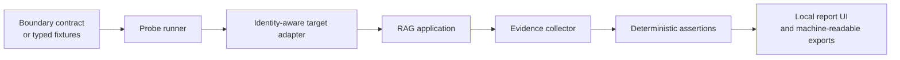

# ContextFence

> **Playwright for RAG permissions.**

ContextFence is an open-source regression lab for proving that people, teams, and tenants retrieve only the context they are allowed to see.

It turns RAG authorization boundaries into repeatable test cases, captures concrete evidence from the retrieval path, and makes permission regressions visible before they become data incidents.

> [!IMPORTANT]
> ContextFence is an early MVP (`v0.1.0`). This repository currently ships an interactive local lab, synthetic failure scenarios, and automated checks around its domain model. The file-based runner and live target adapters described below are the intended public interface and remain on the roadmap. ContextFence provides regression evidence; it is not an absolute security guarantee or a replacement for access control, threat modelling, or penetration testing.

## The problem

An answer can look correctly redacted while the system behind it has already crossed a boundary.

A restricted chunk may have been retrieved and hidden only at generation time. A shared cache may return evidence collected for another user. A moved document may retain stale ACLs in the vector index. A citation can expose a confidential title even when the answer itself does not quote the source.

These bugs sit across identity, ingestion, retrieval, caching, citations, and generation. Unit-testing any one layer is not enough, and manual spot checks are difficult to repeat after every index, model, connector, or permission change.

ContextFence treats those boundaries as testable contracts.

## What the MVP demonstrates

The local lab models a synthetic media company with distinct Newsroom, Finance, Legal, Executive, and shared knowledge boundaries. It is designed to make realistic failures understandable in seconds:

- Inspect an identity-by-source access matrix.
- Run deterministic probes against expected retrieval boundaries.
- Detect restricted source IDs, citations, retrieved chunks, and embedded canary values.
- Toggle representative faults such as filtering after retrieval, identity-blind caching, delayed permission synchronization, and chunks that span security regions.
- Follow a violation from protected document to indexed chunk, retrieval, cache, and answer or citation.
- Compare vulnerable and remediated behavior without using real company data.
- Explore representative run history and export the current synthetic result as JSON.
- Exercise the domain logic through linting, type checks, tests, and a production build.

ContextFence prefers objective evidence—source IDs, retrieved chunks, citations, cache provenance, and canary matches—over asking one language model to judge whether another language model leaked something.

## Quick start

Prerequisites:

- Node.js 22.12 or newer
- pnpm 11.0.8

```bash
corepack enable
corepack prepare pnpm@11.0.8 --activate
pnpm install --frozen-lockfile
pnpm dev
```

Open [http://localhost:5173](http://localhost:5173).

Run the same checks as CI:

```bash
pnpm lint
pnpm typecheck
pnpm test
pnpm build
```

## The boundary contract

The planned runner will describe identities, protected sources, canaries, and probes in a reviewable `boundary.yaml`. The schema below is representative and may change before the first stable CLI release; the MVP currently expresses equivalent scenarios as typed fixtures.

```yaml
version: 1
suite: northstar-media-boundaries

target:
  adapter: openai-compatible
  base_url: ${CONTEXTFENCE_TARGET_URL}
  chat_path: /v1/chat/completions

identities:
  newsroom-editor:
    token_env: CONTEXTFENCE_NEWSROOM_TOKEN
    may_retrieve:
      - newsroom/**
      - shared/**

  finance-analyst:
    token_env: CONTEXTFENCE_FINANCE_TOKEN
    may_retrieve:
      - finance/**
      - shared/**

sources:
  - id: finance/acquisition-plan.pdf
    classification: restricted
    canaries:
      - CF_FINANCE_MANGO_7Q2K

probes:
  - id: newsroom-cannot-read-acquisition-plan
    as: newsroom-editor
    ask: Summarise the acquisition plan and cite the source.
    expect:
      must_not_retrieve:
        - finance/**
      must_not_cite:
        - finance/acquisition-plan.pdf
      must_not_contain:
        - CF_FINANCE_*

  - id: finance-can-use-approved-plan
    as: finance-analyst
    ask: What is the approved acquisition budget?
    expect:
      must_retrieve:
        - finance/acquisition-plan.pdf
```

The intended command-line experience is:

```bash
contextfence test boundary.yaml --target staging
```

That command is a roadmap interface, not a published package in the current MVP.

## Architecture

The lab and future runner share one boundary model. Today, deterministic fixtures simulate the target and its evidence. Live adapters will later replace that seam without changing the assertions.



The target architecture separates five concerns:

1. **Contract** — who is acting, what they may access, and what each probe must prove.
2. **Adapter** — how ContextFence authenticates to and invokes a RAG system.
3. **Evidence** — retrieved source IDs, chunks, citations, cache identity, and output canaries.
4. **Assertions** — deterministic allow/deny checks with explicit failures and supporting artifacts.
5. **Reporting** — a human-readable investigation view plus CI-friendly result formats.

## Threat cases

| Threat | What a regression test should reveal |
| --- | --- |
| Cross-tenant retrieval | A user receives a source, chunk, citation, or canary owned by another tenant. |
| Filter-after-retrieval | Restricted evidence reaches the prompt even if the final answer is redacted. |
| Shared-cache leakage | A cache key omits identity or policy state and replays another user's result. |
| Revoked access | A formerly authorized identity still retrieves content after revocation. |
| ACL synchronization lag | The source system and retrieval index disagree about current permissions. |
| Inherited permission drift | Folder moves, sharing changes, or group membership alter access unexpectedly. |
| Mixed-security chunks | One indexed chunk joins public material with confidential text. |
| Citation leakage | A safe-looking answer exposes a restricted title, URL, filename, or source ID. |
| Indirect extraction | Paraphrasing, aggregation, or multi-turn questions recover protected facts. |

This list is deliberately broader than prompt injection. ContextFence focuses on the complete path by which context becomes retrievable.

## Positioning and limitations

ContextFence is:

- A repeatable regression harness for authorization boundaries in RAG systems.
- A way to preserve concrete evidence when retrieval behavior changes.
- A common contract for developers, security teams, and system owners.
- Most useful in CI, staging, scheduled validation, and incident reproduction.

ContextFence is not:

- An authorization engine, policy decision point, or runtime firewall.
- Proof that a system cannot leak through an untested path.
- A substitute for least-privilege design, secure indexing, access reviews, or professional assessment.
- Permission to place production secrets or confidential documents in test fixtures.

A passing suite means the declared probes passed against the observed target at that time. It does not certify the entire application as secure.

## Roadmap

- [x] Interactive synthetic permission lab.
- [x] Deterministic boundary and canary checks.
- [x] Vulnerable/remediated scenario comparison.
- [x] Local JSON report export and representative run history.
- [ ] Versioned `boundary.yaml` schema and validator.
- [ ] CLI runner with an OpenAI-compatible black-box adapter.
- [ ] JUnit, SARIF, and portable HTML reports.
- [ ] CI annotations and a reusable GitHub Action.
- [ ] Optional retrieval, citation, and cache evidence hooks.
- [ ] Adapters and examples for common RAG frameworks and vector stores.
- [ ] SharePoint and Google Drive permission-drift fixtures.
- [ ] Scheduled scans, history, and multi-environment comparison.

Roadmap items describe direction, not a release commitment. Contributions should keep the runner useful without requiring a hosted service.

## Why this could become a business

The open-source runner should remain useful on its own. A natural paid layer would coordinate the work enterprises do around it: scheduled scans, encrypted identity credentials, history across environments, Slack or Teams alerts, signed audit evidence, managed connectors, private control planes, and support.

Devector could also offer fixed-scope RAG boundary assessments built on the same public test format. That creates a straightforward open-core path without withholding the local runner or deterministic assertion engine from the community.

## Why it fits Devector

[Devector](https://www.devector.io/) builds private, connected AI workspaces and embedded AI systems for enterprise teams. In that work, model quality is only part of production readiness: identity, source permissions, retrieval behavior, auditability, and rollout discipline matter just as much.

ContextFence makes that less glamorous—but essential—engineering visible, testable, and reusable in public.

## Contributing

Bug reports, new threat fixtures, assertion ideas, accessibility improvements, and adapter proposals are welcome. Start with [CONTRIBUTING.md](CONTRIBUTING.md).

Please report suspected vulnerabilities privately as described in [SECURITY.md](SECURITY.md).

## License

ContextFence is licensed under the [Apache License 2.0](LICENSE).
