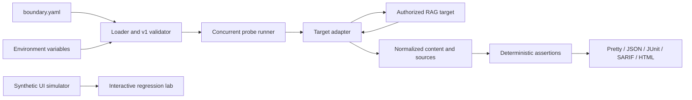
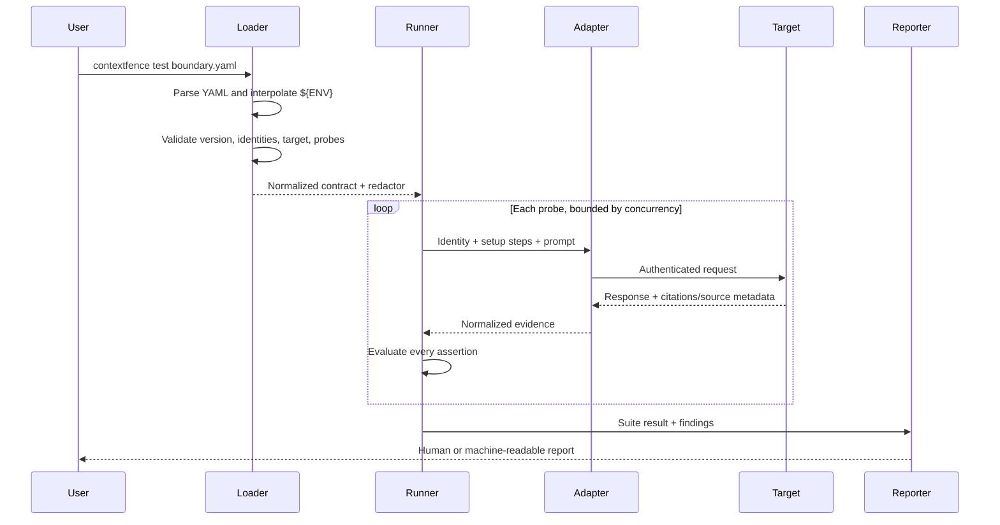

# ContextFence architecture

ContextFence is a black-box regression harness. A contract declares an identity boundary and the evidence that must or must not be observable; the runner invokes an authorized test target and turns the result into deterministic findings.

It is intentionally not a proxy, policy decision point, vector database, or authorization engine. It tests the behavior of those systems from the outside.

## System shape



The CLI and interactive lab share a problem domain, but they have different execution paths in the current release:

- The CLI loads YAML contracts and invokes mock or OpenAI-compatible targets.
- The browser lab runs typed, deterministic scenarios entirely in the client. It does not receive target credentials and does not call the CLI.

That separation keeps the portfolio demo safe to host publicly while the CLI runs in the operator's trusted environment.

## CLI execution sequence



The important seam is normalized evidence. Assertions do not need to know how a framework stores chunks, and adapters do not decide whether a boundary passed.

## Components

### Contract loader

The v1 loader owns:

- YAML parsing with field-level diagnostics.
- `${NAME}` and `${NAME:-fallback}` environment interpolation.
- Schema normalization and rejection of unknown fields.
- Identity, probe, assertion, severity, URL, and header validation.
- Expansion of the optional `matrix` block into ordinary v1 probes.
- A longest-first redactor for interpolated and configured credential values.

Contracts are reviewable security artifacts. Keep real credentials out of them even though the loader redacts known values from its own diagnostics.

### Matrix expansion

A contract may declare a `matrix` block instead of (or alongside) explicit probes: identities, and for each source an identifier, a synthetic canary, and an `allow` list. Validation expands the identity × source cross-product deterministically — every unauthorized identity becomes a critical deny probe (`source_absent` + `not_contains` the canary) and every authorized identity becomes a medium positive control. Expansion happens entirely inside the loader, before the runner sees the contract, so adapters, assertions, reporters, severities, and exit codes are unchanged, and a violated cell reports the YAML position of its matrix source entry.

### Access-manifest generator

`contextfence generate` is a build-time codegen step, not a runtime component. It reads a connector-neutral access manifest (identities, sources, per-source `allow` lists — the shape an IdP or permissions export produces), derives probe keys and canaries deterministically when omitted, fails closed on unknown fields, duplicate keys, undefined identities, and identity ids whose derived credential placeholders collide, and emits a matrix contract with environment placeholders instead of secrets. The generated file is an ordinary contract: it earns no trust from having been generated and passes through the full loader on every run.

### Probe runner

The runner bounds concurrency and applies one aggregate timeout to each probe, including all of its setup requests and primary request. A probe may include setup requests—for example, priming a cache under one identity—before its primary request runs under the identity being tested.

Setup exists to reproduce stateful boundaries, not to mutate production data. Operators remain responsible for making every prompt and target operation safe, authorized, and reversible.

### Target adapters

`mock` maps probe and setup IDs to deterministic response content, source IDs, status, and delay. It is useful for contract authoring, examples, reporter integration, and CI smoke tests.

`openai-compatible` sends chat-completion requests and normalizes response text and exposed citation/source metadata. A target can receive suite-level headers plus identity-specific headers. URLs must use HTTPS, except loopback HTTP for local development, and credentials in URLs are rejected.

An adapter is an evidence transport, not a trust oracle. It must preserve target evidence faithfully and must never silently turn missing retrieval metadata into proof that retrieval was safe.

### Assertion engine

The v1 contract supports deterministic checks over response content and normalized sources:

| Assertion | Pass condition |
| --- | --- |
| `contains` | Response content contains the literal value. |
| `not_contains` | Response content does not contain the literal value. |
| `matches` | Response content matches the regular expression. |
| `not_matches` | Response content does not match the regular expression. |
| `source_present` | The normalized source list contains the value. |
| `source_absent` | The normalized source list does not contain the value. |

Negative assertions default to critical severity; positive controls default to medium. Explicit severity is recommended for contracts reviewed as policy.

### Reporters

Every reporter consumes the same suite result:

- Pretty output is for local investigation.
- JSON is the stable machine-readable evidence artifact.
- JUnit integrates with test-result viewers.
- SARIF integrates with code-scanning interfaces.
- HTML is a portable investigation report.

Reports are potentially sensitive. A report can expose prompts, document identifiers, citations, synthetic canaries, error details, and partial target output even when it does not contain configured credentials.

## Trust boundaries

| Boundary | ContextFence controls | Operator still controls |
| --- | --- | --- |
| Contract to process | Strict schema, environment interpolation, known-secret redaction | Who can read or modify the contract and environment |
| Process to target | HTTPS requirement, loopback development exception, managed HTTP headers, timeouts | DNS, egress policy, target ownership, certificate trust, endpoint behavior |
| Identity to target | Explicit identity-specific headers and prompts | Least-privilege test accounts, token lifetime, server-side authorization |
| Target to evidence | Response-size limit and normalized observable evidence | Whether the target exposes complete retrieval/citation metadata |
| Evidence to report | Deterministic findings and credential-value redaction | Artifact retention, access control, downstream log and CI visibility |
| GitHub Action to npm | Exact package-version input and workspace path confinement | Pinning the Action ref, runner integrity, approved contracts and secrets |

Treat the runner as a security testing client with network access and short-lived test credentials. Run it on trusted CI runners, restrict egress to the intended target, and protect report artifacts at least as strongly as the source index being tested.

## Data and secret lifecycle

```text
secret store -> process environment -> contract interpolation -> request headers
                                           |
                                           +-> redactor values

target response -> normalized evidence -> findings -> selected reporter -> artifact retention
```

ContextFence does not persist a central run database. The chosen output file and CI logs are the durable artifacts. The open-source CLI does not need a hosted ContextFence account.

Known configured credentials are redacted, but arbitrary secrets returned by the target cannot be identified reliably. Use synthetic canaries, not real secrets, and configure CI artifact retention deliberately.

## Extension rules

New work should preserve these boundaries:

1. Put provider-specific request and evidence mapping in an adapter.
2. Normalize evidence before evaluating policy.
3. Keep assertions deterministic and side-effect free.
4. Add paired vulnerable and remediated fixtures for a new threat case.
5. Keep machine-readable formats versionable and avoid leaking request headers.
6. Fail closed on malformed contracts, missing identities, invalid regular expressions, unsafe URLs, and target/runtime failures.

## Security limitations

A passing suite means only that the declared assertions passed against the evidence the target exposed during that run. It does not prove that:

- every identity, source, cache key, connector, group transition, or query was tested;
- a target omitted no restricted chunks before generation;
- source and citation metadata is complete or truthful;
- a model cannot reveal protected information through paraphrase or aggregation;
- DNS, redirects, proxies, or infrastructure outside the process are safe; or
- the underlying authorization implementation is correct.

Use ContextFence alongside threat modelling, least privilege, ingestion and cache reviews, access audits, conventional application tests, and authorized security assessment.
